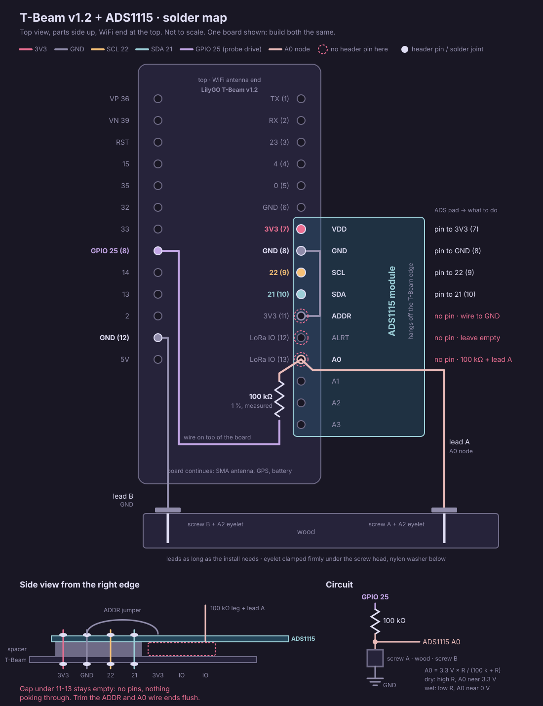

# Wiring: Wood Moisture Prototype (T-Beam v1.2 + ADS1115)

Bench prototype wiring. Since firmware 1.3.0, this wiring **is** the firmware's
default measurement path (`USE_EXTERNAL_ADC` true, shipped default) - see
docs/firmware_architecture.md §2.2 for the sensor-layer behavior and
docs/deployment_guide.md §2.1 for the field-deployment wiring pointer.

- **Board: LilyGO T-Beam v1.2** (AXP2101 PMIC), 868 MHz version. The frequency
  variant changes nothing here: same header, same wiring.
- **Probe = two bare A2 stainless screws in the wood** (two-electrode
  resistive). Each lead is soldered to an A2 stainless eyelet (ring terminal);
  the screw passes through the eyelet and clamps it under its head. Resistance
  between the screws falls as moisture rises.
- **ADS1115** (16-bit I2C ADC) is stacked straight onto the T-Beam header and
  reads the divider node on A0. The ESP32 internal ADC (GPIO 35) is unused.
- **No DS18B20 in this build.** Its wiring, for later, is in
  docs/deployment_guide.md §2.2.

## Diagram



## Parts (per board)

| Part | Note |
|------|------|
| T-Beam v1.2 | no OLED fitted on the right header (see step 1) |
| ADS1115 module | pin order VDD, GND, SCL, SDA, ADDR, ALRT, A0, A1, A2, A3 |
| 4-pin straight male header | cut from a strip |
| 100 kΩ resistor, 1 % | measured before fitting (see step 2) |
| thin insulated wire | ADDR jumper, GPIO 25 wire, probe leads A and B |
| heat shrink | for the lead A joint |
| A2 stainless eyelet (ring terminal), 2 | one per screw, soldered to its lead |
| nylon washer, 2 | under each eyelet, keeps it off the wood surface |

## Header pin positions (T-Beam v1.2)

Positions count from the WiFi-antenna end (top). Taken from LilyGO's v1.2
schematic (`LilyGo_TBeam_V1.2-lastest.pdf`, sheet 4, headers U12 and U14).

**Right header**

| Pos | Net | In this build |
|-----|-----|---------------|
| 1-5 | TX, RX, 23, 4, 0 | - |
| 6 | GND | - |
| 7 | 3V3 | header pin, ADS VDD |
| 8 | GND | header pin, ADS GND |
| 9 | GPIO 22 (SCL) | header pin, ADS SCL |
| 10 | GPIO 21 (SDA) | header pin, ADS SDA |
| 11 | 3V3 | **no pin** (ADS ADDR sits above it) |
| 12 | LoRa IO (radio) | **no pin** (ADS ALRT sits above it) |
| 13 | LoRa IO (radio) | **no pin** (ADS A0 sits above it) |

**Left header** (only the two holes used)

| Pos | Net | In this build |
|-----|-----|---------------|
| 8 | GPIO 25 | wire from the 100 kΩ |
| 12 | GND | probe lead B |

Positions 11-13 are why only four pins go in: 11 is 3V3 (`VCC_2_5V`, tied to
+3V3 by a 0 Ω link), and 12/13 are the radio's DIO lines (GPIO 32/33 through
22 Ω). A pin there would tie ADDR to 3V3 and A0/ALRT to the radio.

## Steps

1. **Check for an OLED.** If LilyGO's OLED is already soldered on right
   positions 7-10, stop: it uses the same four pins.
2. **Measure the resistor** and write the value on the board. Use it if it
   reads 99-101 kΩ. An exact 100.0 kΩ part is not needed (see Notes).
3. **Header pins.** Put the 4-pin strip into right positions 7-10 (3V3, GND,
   22, 21), short ends down, plastic spacer on the top side. Solder from the
   underside. Leave 11-13 empty.
4. **Stack the ADS1115** onto the long ends: VDD on 7 (3V3), GND on 8, SCL on
   9 (22), SDA on 10 (21). The body hangs off the T-Beam's right edge. Check
   VDD and SDA positions before soldering. The pin order decides, not which way
   the labels read: on the Adafruit board this is chip side up. Solder the four
   joints on top.
   If the ADS1115 came with a 10-pin header already soldered on, cut the
   ADDR, ALRT, A0 and A1-A3 pins off flush on the underside first.
5. **ADDR jumper.** Short wire on top of the ADS1115 from ADDR to GND. Trim
   flush underneath: 3V3 (position 11) is directly below.
6. **Resistor.** One leg into the ADS1115 A0 hole from the top, soldered and
   trimmed flush underneath (a radio line is directly below). The other leg
   goes through an insulated wire to the T-Beam **left** hole GPIO 25
   (position 8).
7. **Probe lead A** soldered to the resistor's A0 leg just above the pad,
   heat shrink over the joint.
8. **Probe lead B** to the T-Beam **left** hole GND (position 12).
9. **Leads to the eyelets**, one per screw: solder each lead to its eyelet and
   wash the flux off. Fit a nylon washer, then the eyelet, under each screw head
   and tighten. Which screw gets A or B does not matter.

Repeat for the second board.

## Checks (power off, multimeter)

| Between | Expect |
|---------|--------|
| right 3V3 (7) and GND (8) | not a short (a reading climbing from low is the capacitors charging, fine) |
| ADS ADDR and ADS GND | ~0 Ω |
| left GPIO 25 (8) and ADS A0 | the value written on the board, ~100 kΩ |
| ADS A0 and T-Beam right position 13 | open, no connection |
| lead A and lead B, screws not in wood | open, > 10 MΩ |
| each lead end and its screw head, eyelet clamped | < 1 Ω |

Then power up with serial at 115200. The sensor init line should read:

```
[Sensor] ADS1115 found (external ADC, A0). Addr: 0x48
```

`ADS1115 NOT found!` means check the ADDR jumper first (0x49 if it touches
3V3), then SDA/SCL.

## Divider

```
  GPIO 25 ──100kΩ(1%)──┬── ADS1115 A0   (ADC reads this node)
 (drive HIGH only       │
  during a measurement) screw A + eyelet
                        (wood)
                        screw B + eyelet
                         │
                        GND

  A0 = 3.3V * R_wood / (100k + R_wood)
  dry wood  -> high R -> A0 near 3.3 V
  wet wood  -> low  R -> A0 near 0 V
```

## Connections

**ADS1115 -> T-Beam**

| ADS1115 | T-Beam |
|---------|--------|
| VDD | 3V3, right position 7 (header pin) |
| GND | GND, right position 8 (header pin) |
| SCL | GPIO 22, right position 9 (header pin) |
| SDA | GPIO 21, right position 10 (header pin) |
| ADDR | ADS GND pad, jumper wire (I2C address 0x48) |

**Divider / probe**

| from | to |
|------|----|
| 100 kΩ leg | ADS1115 A0 |
| 100 kΩ other leg | GPIO 25, left position 8 (wire) |
| probe lead A (screw A) | ADS1115 A0 (same node as the 100k) |
| probe lead B (screw B) | GND, left position 12 |

## Notes

- **ADDR -> GND = 0x48** (firmware default). ADDR to 3V3 would be 0x49 and the
  firmware would not find the ADC.
- **Resistor tolerance barely matters.** The firmware assumes exactly
  100000 Ω (`R_PULLUP_OHMS` in `include/config.h`). On the Douglas-fir curve
  in `include/wood_species_data.h`, a resistor 1 % off shifts the reading by
  about 0.03 MC points, 5 % off by about 0.15. A standard 1 % part is fine;
  record its measured value anyway.
- **Screw contacts.** A loose or corroded eyelet adds resistance in series
  with the wood and reads as drier wood, or as an open circuit. Screw and eyelet
  are both A2 stainless, so there is no galvanic pair at the clamp; keep it
  tight. Soldering to stainless needs an aggressive flux: wash the residue off,
  since it corrodes the joint and leaks current.
- **Nylon washer under each eyelet.** The eyelet and screw head sit on the wood
  surface, which is wetter than the core right after wetting; the washer keeps
  that surface out of the reading. Shaft insulation is not needed at ~5 mm
  depth in a 10 mm slab: the whole embedded length is the measuring tip.
- **GPIO 35 and GPIO 32 stay free.** On v1.2, GPIO 35 is the AXP2101 interrupt
  (per LilyGO's pin map) and GPIO 32 is the radio BUSY line.
- ADS1115 used **single-ended on A0** (node to GND).
- Power the ADS1115 from 3V3, not 5V/VUSB, to keep A0 within input range.
